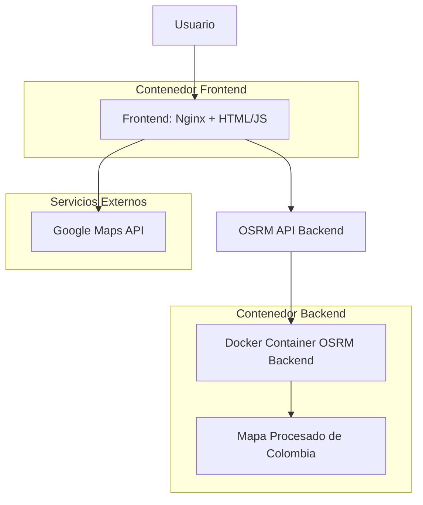

# Prueba OSRM Colombia

Una aplicación web completa para el cálculo de rutas y optimización de viajes en Colombia utilizando Open Source Routing Machine (OSRM). Esta prueba de concepto integra un backend OSRM dockerizado con un frontend interactivo basado en Google Maps.

## Características Principales

- **Cálculo de Rutas**: Rutas punto a punto con geometría completa y alternativas
- **Optimización TSP**: Reordenamiento inteligente de puntos para rutas eficientes (Traveling Salesman Problem)
- **Matriz de Tiempos/Distancias**: Cálculo de tiempos y distancias entre múltiples puntos
- **Ajuste de GPS**: Corrección de coordenadas imprecisas a la red vial (Map Matching)
- **Punto Más Cercano**: Localización del punto de calle más cercano
- **Interfaz Interactiva**: Mapa de Google Maps con clics para agregar puntos
- **Dockerizado**: Fácil despliegue con Docker Compose

## Requisitos del Sistema

- Docker y Docker Compose
- Conexión a internet para descarga inicial del mapa de Colombia
- Clave de API de Google Maps (para el frontend)

## Instalación y Configuración

### 1. Clonar el Repositorio

```bash
git clone <url-del-repositorio>
cd prueba-osrm-colombia
```

### 2. Configurar Google Maps API

Obtén una clave de API de Google Maps desde [Google Cloud Console](https://console.cloud.google.com/).

Edita `frontend/index.html` y reemplaza la clave en la línea:

```javascript
src="https://maps.googleapis.com/maps/api/js?key=TU_CLAVE_AQUI&libraries=geometry"
```

### 3. Ejecutar con Docker Compose

```bash
docker-compose up --build
```

El proceso inicial tomará tiempo (~10-15 minutos) ya que descarga y procesa el mapa de Colombia (~500MB).

### 4. Acceder a la Aplicación

- **Frontend**: http://localhost:5500
- **API Backend**: http://localhost:5000

## Uso de la Aplicación

1. Abre http://localhost:5500 en tu navegador
2. Selecciona el servicio deseado (Route, Trip, Table, Match, Nearest)
3. Haz clic en el mapa para agregar puntos
4. Configura las opciones específicas del servicio
5. Haz clic en "EJECUTAR CONSULTA"
6. Visualiza los resultados en el panel inferior (Resumen Visual o JSON Crudo)

### Servicios Disponibles

- **Route**: Ruta directa entre puntos en el orden especificado
- **Trip**: Optimización TSP con reordenamiento inteligente
- **Table**: Matriz de tiempos/distancias todos contra todos
- **Match**: Ajuste de coordenadas GPS a la red vial
- **Nearest**: Encuentra el punto de calle más cercano

## Arquitectura

La aplicación sigue una arquitectura cliente-servidor simple con contenedores Docker.



### Componentes

- **Backend (OSRM)**: Contenedor Docker basado en `osrm/osrm-backend:latest`
  - Descarga mapa OSM de Colombia
  - Preprocesa con algoritmos: extract, partition, customize
  - Sirve API REST en puerto 5000
  - Usa algoritmo MLD (Multi-Level Dijkstra) para rendimiento

- **Frontend**: Contenedor Nginx sirviendo aplicación web estática
  - Interfaz HTML/CSS/JavaScript vanilla
  - Integración con Google Maps API
  - Comunicación AJAX con backend OSRM
  - Visualización de resultados con polylines y markers

## Endpoints de la API OSRM

La aplicación utiliza los siguientes endpoints de OSRM v1:

- `GET /route/v1/driving/{coordinates}` - Cálculo de rutas
- `GET /trip/v1/driving/{coordinates}` - Optimización de viajes
- `GET /table/v1/driving/{coordinates}` - Matriz de tiempos/distancias
- `GET /match/v1/driving/{coordinates}` - Ajuste de coordenadas
- `GET /nearest/v1/driving/{coordinates}` - Punto más cercano

### Parámetros Comunes

- `overview`: Nivel de detalle de geometría (full/simplified)
- `steps`: Incluir instrucciones de navegación
- `geometries`: Formato de geometría (polyline/geojson)
- `annotations`: Tipo de anotaciones (duration/distance)

## Desarrollo y Contribución

### Estructura del Proyecto

```
prueba-osrm-colombia/
├── docker-compose.yml      # Orquestación de contenedores
├── README.md              # Esta documentación
├── backend/
│   ├── Dockerfile         # Imagen OSRM personalizada
│   └── entrypoint.sh      # Script de inicialización
└── frontend/
    ├── Dockerfile         # Imagen Nginx
    └── index.html         # Aplicación web
```

### Personalización

- **Cambiar Región**: Modifica la URL de descarga en `backend/entrypoint.sh`
- **Ajustar Perfiles**: Reemplaza `car.lua` en el contenedor para perfiles personalizados
- **Algoritmos**: Cambia `OSRM_ALGORITHM` en `docker-compose.yml` (mld/ch/dml)

### Contribuir

1. Fork el repositorio
2. Crea una rama para tu feature (`git checkout -b feature/nueva-funcionalidad`)
3. Commit tus cambios (`git commit -am 'Agrega nueva funcionalidad'`)
4. Push a la rama (`git push origin feature/nueva-funcionalidad`)
5. Abre un Pull Request

## Licencia

Este proyecto es de código abierto bajo la licencia MIT. Ver archivo LICENSE para más detalles.

## Referencias

- [Documentación OSRM](https://github.com/Project-OSRM/osrm-backend/blob/master/docs/nodejs/api.md)
- [OSRM Backend GitHub](https://github.com/Project-OSRM/osrm-backend)
- [OpenStreetMap Colombia](http://download.geofabrik.de/south-america/colombia.html)